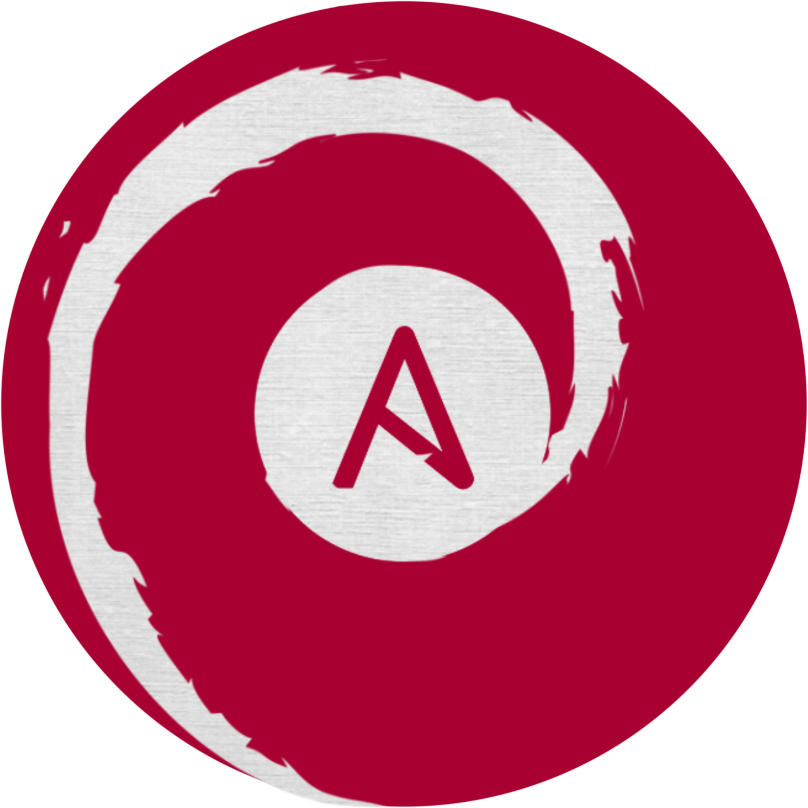

<div align="center">
  
  <br>
  <br>
  <h1>lvnatic.debian</h1>
  <i>lvnatic.debian is an Ansible collection written to provision
    <br> Debian 12+ virtual machines locally.</i>
  <br>
</div>

<div align="center">
  <a href="https://docs.ansible.com/ansible/latest/collections_guide/index.html">
  using ansible collections</a>
  •
  <a href="https://discord.gg/nh7mqGEfbw">L V N A C Y Discord</a>
  •
  <a href="https://blog.ephemeralrogue.xyz/detour-through-ansible#heading-ephemeralroguebookworm">project writeup</a>
  <br>
</div>
<br>
<br>

# The Quick and Dirty

This collection is written for the express purpose of provisioning Debian 
v12+ virtual machines (VM) locally. The primary playbook prepares the 
environment for and installs the following packages:

- [Docker](https://docs.docker.com/engine/)
- [Docker Compose](https://docs.docker.com/compose/) (plugin)
- [ProtonVPN](https://protonvpn.com/)
- [GitHub CLI](https://cli.github.com/)
- [VS Code](https://code.visualstudio.com/)
- [Warp Terminal](warp.dev)

and configures Docker to run in Rootless Mode and git with my preferred 
options. Additionally, other playbooks are provided to install:

- [Minikube](https://minikube.sigs.k8s.io/docs/)
- [kubectl](https://kubernetes.io/docs/reference/kubectl/kubectl/)
- [Kvantum Manager](https://github.com/tsujan/Kvantum/tree/master/Kvantum) 
  for the upcoming Debian Trixie when installed with KDE Plasma
- [kde-config-sddm](https://packages.debian.org/experimental/kde-config-sddm) 
  for the test version of Debian: Trixie, when installed with KDE Plasma

That's pretty much it at the moment!

> [!NOTE]
> This isn't lunatic in any sense. I just liked the name.

# Contents

- [usage](#usage)
  - [running playbooks locally](#usage_local)
  - [running playbooks on remote hosts](#usage_remote)
- [project updates](#updates)
- [future development](#future_dev)
- [contributing](#contributing)


# Usage

This collection is not yet ready to be uploaded to Ansible Galaxy, therefore 
the best way to make use of it at the moment is to clone it to the machine 
on which you want to locally run playbooks.  
*note: the {{ user }} variable assumes you are using the same username on 
your system as you will use for git.*

1. To get started, you'll need to set up passwordless sudo:

    ```sh
    sudo visudo
    ```

    running a playbook will assume passwordless sudo, as Ansible will not 
    prompt you to enter a password at each juncture it requires. if you like, 
    you can return and turn off passwordless sudo once you've completed 
    running the playbooks.  

    `visudo` provides checks on this file to ensure syntax is appropriate. use 
    other edits at your own discretion, caution, peril, whatever. find the 
    line defining the `sudo` group's permissions and change it to:

    ```sh
    %sudo   ALL=(ALL:ALL) NOPASSWD:ALL
    ```

    save and exit.
    
2. [Install Ansible](https://docs.ansible.com/ansible/latest/installation_guide/index.html) 
    on the machine you want to provision, as the playbooks are all written to 
    run locally (`hosts: localhost`):

    ```sh
    sudo apt update
    sudo apt install ansible
    ```

3. Clone this repository and navigate to its directory:

    ```sh
    git clone https://github.com/ephemeralrogue/ephemeralrogue.debian.git
    cd /path/to/repository/
    ```

4. Copy `vars.yaml.template` and rename to `vars.yaml`. Fill in the blanks.  
<br>

[back to contents](#contents)

## Running Playbooks Locally

The main playbook is `provision_debian.yaml` and can be run as such:
```bash
ansible-playbook -i 127.0.0.1, playbooks/provision_debian_bookworm.yaml
```
where "127.0.0.1" sets the targe as localhost. also, that comma is 
fucking necessary. i failed to run this so many times when i was testing it 
because i didn't know about that stupid comma. this playbook will provide 
a basic set of development tools for both 
[Bookworm](https://www.debian.org/releases/bookworm/) and 
[Trixie](https://www.debian.org/releases/trixie/).

Other playbooks you can run to install apps independently are:

- install_code.yaml
- install_docker.yaml
- install_gh.yaml
- install_kdeconfigsddm.yaml
- install_kubectl.yaml
- install_kvantum.yaml
- install_minikube.yaml
- install_protonvpn.yaml
- install_warp.yaml

To install VS Code, Docker, GitHub CLI, `kde-config-sddm` (for Debian Trixie), 
kubectl, Kvantum Manager (for Debian Trixie), Minikube, ProtonVPN, and Warp 
Terminal, respectively. note that kubectl will be installed as part of the 
Minikube playbook. in addtion, the following playbooks can be run on their own:

- git_config.yaml
- load_apt_keys.yaml
- remove_apt_packages.yaml
- rootless_docker.yaml

More playbooks will be added as other tools become more prominent in my 
development, design, or general enjoyment process.

> [!NOTE]
> When running the main provisioning or git config playbooks, you will 
> be prompted to designate default branch and remote names.

[back to contents](#contents)

## Running Playbooks On Remote Hosts

if you want to run these playbooks on remote nodes, you'll need to edit 
the `hosts` directive on the playbooks. checkout a new branch, make your 
changes, and run from there. instead of passing an IP address with the 
inventory flag `-i`, you can pass an inventory file or hosts directive.

[back to contents](#contents)

# Project Updates

- [warp terminal](https://www.warp.dev/) tasks were added to retrieve gpg 
  key and add apt repository to source list. Warp install is now automated.
- with some exception, `command` and `shell` tasks were migrated to their 
  respective `get_url` and `apt_repository` modules.
- playbooks and tasks were entirely refactored to accommodate the setup and 
  installation of individual apps and provide a framework for adding new 
  playbooks.
- ansible-lint GitHub Actions workflow was added to improve adherence to 
  Ansible community guidelines for Ansible Collections.
- created playbook to set up [rootless Docker](https://docs.docker.com/engine/security/rootless/)
- created playbook to install configuration settings for SDDM when using KDE
  Plasma 6 on Debian testing version
- created playbook to enable clipboard and directory sharing through VirtFS 
  with, [UTM](https://getutm.app/) when spinning up VMs
- reconfigured project to support Debian 12+

See [CHANGELOG](./CHANGELOG.md) for full details.

[back to contents](#contents)

# Future Development

- Find cmake module with support for current Ansible versions
- Write unit and integration tests where applicable
- Set up debug points and prompts where applicable
- Review existing cmake modules for possible inclusion

[back to contents](#contents)

# Contributing

if you would like to contribute to this project, feel free to fork and write! 
please adhere to most best practices as developed by the Ansible community. 
submit a PR when you feel your work is ready. and please adhere to the code of 
conduct and contributing guidelines when discussing issues and proposed 
changes.

[back to contents](#contents)